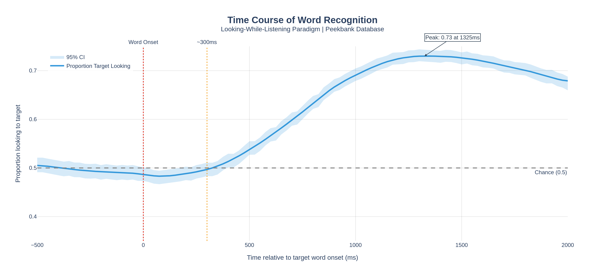
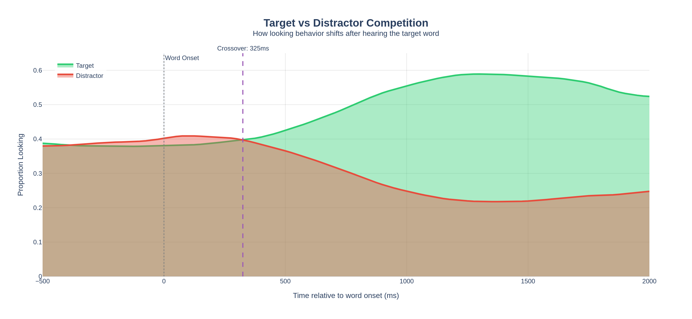

# 🔬 Peekbank Analysis: Children's Word Recognition

[](https://colab.research.google.com/github/YOUR_USERNAME/peekbank-analysis/blob/main/Peekbank_Interactive_Analysis.ipynb)
[](https://opensource.org/licenses/MIT)
[](https://www.python.org/downloads/)
[](https://plotly.com/)

A comprehensive Python analysis of the **Peekbank database** with **beautiful, interactive Plotly visualizations** - studying infant eye-tracking data from looking-while-listening experiments on children's word recognition.

<p align="center">
  
</p>

## ✨ Features

- 🎨 **10 Interactive Plotly Visualizations** - Hover, zoom, and explore
- 📊 **Professional Color Schemes** - Colorblind-friendly palettes
- 📁 **Automatic Data Export** - CSV files for further analysis
- 🖼️ **High-Resolution PNG Export** - Publication-ready figures
- 🌐 **Interactive HTML Export** - Share visualizations easily

## 📖 Overview

### What is Peekbank?

Peekbank is a large-scale, open database of infant and toddler eye-tracking data aimed at facilitating the study of developmental changes in children's word recognition. The database aggregates data from multiple research labs using the **looking-while-listening paradigm**.

**Database Statistics:**
- 📊 **39 datasets** from different research groups
- 👶 **3,537 children** tested
- 📍 **33+ million** eye-tracking timepoints
- 📅 Ages ranging from **6 to 84 months**

### The Looking-While-Listening Paradigm

```
┌─────────────────────────────────────────────────────────────────┐
│                                                                 │
│     🖼️ DOG                              🖼️ CAR                  │
│    (Target)                           (Distractor)             │
│                                                                 │
│                        👶                                       │
│                      (Child)                                    │
│                                                                 │
│                   🔊 "Look at the DOG!"                         │
│                                                                 │
└─────────────────────────────────────────────────────────────────┘
```

Children view two images (target and distractor) while hearing a spoken label. Eye-tracking measures how quickly and accurately they shift their gaze to the named target object.

## 🚀 Quick Start

### Option 1: Google Colab (Recommended)

Click the badge below to run the analysis directly in Google Colab - no installation required!

[](https://colab.research.google.com/github/chemvatho/peekbank-analysis/blob/main/Peekbank_Complete_Analysis.ipynb)

### Option 2: Local Installation

```bash
# Clone the repository
git clone https://github.com/YOUR_USERNAME/peekbank-analysis.git
cd peekbank-analysis

# Create virtual environment
python -m venv venv
source venv/bin/activate  # On Windows: venv\Scripts\activate

# Install dependencies
pip install -r requirements.txt

# Run Jupyter notebook
jupyter notebook Peekbank_Complete_Analysis.ipynb
```

## 📁 Repository Structure

```
peekbank-analysis/
├── Peekbank_Interactive_Analysis.ipynb   # Main notebook with Plotly
├── Peekbank_Complete_Analysis.ipynb      # Alternative (matplotlib version)
├── README.md                             # This file
├── requirements.txt                      # Python dependencies
├── LICENSE                               # MIT License
│
├── peekbank_data/                        # Generated outputs
│   ├── datasets.csv                      # Study metadata
│   ├── subjects.csv                      # Participant info
│   ├── stimuli.csv                       # Word/image info
│   ├── administrations.csv               # Session data
│   ├── word_accuracy.csv                 # Per-word accuracy
│   ├── subject_accuracy.csv              # Per-subject accuracy
│   ├── dataset_stats.csv                 # Per-dataset statistics
│   │
│   ├── plot_01_time_course.html          # Interactive plots
│   ├── plot_02_age_effects.html
│   ├── plot_03_age_distribution.html
│   ├── plot_04_accuracy_by_age.html
│   ├── plot_05_competition.html
│   ├── plot_06_word_accuracy.html
│   ├── plot_07_individual_differences.html
│   ├── plot_08_dataset_comparison.html
│   ├── plot_09_heatmap.html
│   ├── plot_10_summary.html
│   │
│   └── *.png                             # Static image versions
│
└── docs/                                 # Documentation images
    └── time_course_preview.png
```

## 📊 Visualizations Included

| # | Visualization | Type | Description |
|---|--------------|------|-------------|
| 1 | **Time Course** | Line + CI Band | Word recognition over time with 95% confidence intervals |
| 2 | **Age Effects** | Multi-line | Developmental trajectories by age group |
| 3 | **Age Distribution** | Gradient Histogram | Interactive histogram with Viridis colorscale |
| 4 | **Accuracy by Age** | Lollipop Chart | Elegant accuracy comparison with error bars |
| 5 | **Target vs Distractor** | Area Chart | Competition dynamics with crossover point |
| 6 | **Word Accuracy** | Dual Bar Chart | Easiest vs hardest words to recognize |
| 7 | **Individual Differences** | Scatter + Marginals | Age-accuracy correlation with density plots |
| 8 | **Dataset Comparison** | Bubble Chart | Cross-lab comparison with trend line |
| 9 | **Age × Time Heatmap** | Heatmap | Accuracy across age groups and timepoints |
| 10 | **Summary Dashboard** | Indicators | Key metrics at a glance |

### Visualization Features

- 🖱️ **Interactive**: Hover for details, zoom, pan, and export
- 🎨 **Beautiful**: Professional color schemes and typography
- 📱 **Responsive**: Works on desktop and mobile
- 📥 **Exportable**: Download as PNG or interactive HTML

## 🔧 Technical Details

### Database Connection

Peekbank provides public read-only access to their MySQL database:

| Parameter | Value |
|-----------|-------|
| Host | 34.210.173.143 |
| Port | 3306 |
| Database | 2025.1 |
| Username | reader |
| Password | gazeofraccoons |

### Database Schema

```
datasets ──┬── administrations ──┬── aoi_timepoints
           │                     │
           │                     └── trials ── trial_types ── stimuli
           │
           └── subjects
```

**Key tables:**
- `aoi_timepoints`: Eye-tracking data (Area of Interest at each timepoint)
- `administrations`: Session-level data including age
- `stimuli`: Information about target and distractor images
- `trial_types`: Trial configuration including target word

### Key Variables

| Variable | Description |
|----------|-------------|
| `t_norm` | Time relative to target word onset (ms) |
| `aoi` | Area of interest: 'target', 'distractor', 'other', 'missing' |
| `age` | Child's age in months |
| `prop_target` | Proportion looking to target (0-1) |

## 📈 Sample Results

### Key Findings

| Metric | Value |
|--------|-------|
| Overall Accuracy | ~0.62 (significantly above 0.5 chance) |
| Age-Accuracy Correlation | r ≈ 0.25 |
| Word Recognition Onset | ~300ms post word onset |
| Peak Looking | ~700-1000ms |

### Interactive Preview

The visualizations support:
- **Hover** for detailed values
- **Zoom** to explore specific regions
- **Pan** across the time course
- **Download** as PNG directly from the plot

<p align="center">
  
</p>

*Developmental changes in word recognition - older children show faster and more accurate recognition*

## 📚 Citation

If you use this analysis or the Peekbank database, please cite:

```bibtex
@article{zettersten2022peekbank,
  title={Peekbank: An open, large-scale repository for developmental eye-tracking data of children's word recognition},
  author={Zettersten, Martin and Yurovsky, Daniel and Xu, Tian Linger and Urun, Sarp and Meylan, Stephan C and Frank, Michael C and others},
  journal={Behavior Research Methods},
  year={2022},
  publisher={Springer}
}
```

## 🔗 Related Resources

- **Peekbank Website**: https://peekbank.github.io/peekbank-website/
- **Documentation**: https://peekbank.github.io/peekbank-website/docs/documentation/
- **Peekbank GitHub**: https://github.com/peekbank
- **Peekbank OSF**: https://osf.io/pr6wu/
- **Peekbank Shiny App**: Interactive visualization tool
- **Wordbank**: Related database for vocabulary development (https://wordbank.stanford.edu/)

## 🤝 Contributing

Contributions are welcome! Please feel free to submit a Pull Request. For major changes, please open an issue first to discuss what you would like to change.

### Ideas for Extensions

- [ ] Mixed-effects modeling with `statsmodels` or `pymer4`
- [ ] Machine learning prediction of word recognition
- [ ] Phonological feature analysis using CMU Pronouncing Dictionary
- [ ] Link to Wordbank vocabulary norms
- [ ] Bayesian growth curve modeling
- [ ] Cross-linguistic phonetic analysis

## 📄 License

This project is licensed under the MIT License - see the [LICENSE](LICENSE) file for details.

## 👤 Author

Created by [Chem Vatho]

---

*This analysis was created to facilitate reproducible research with the Peekbank database.*
